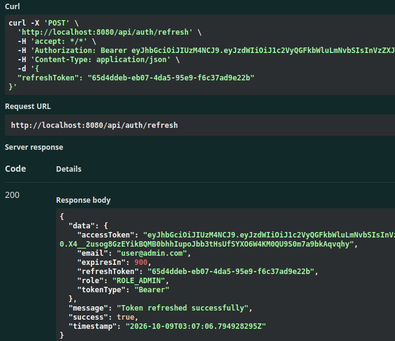
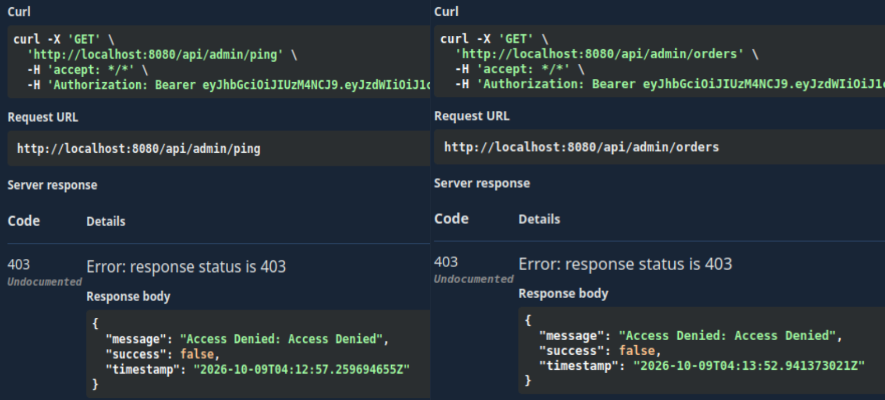
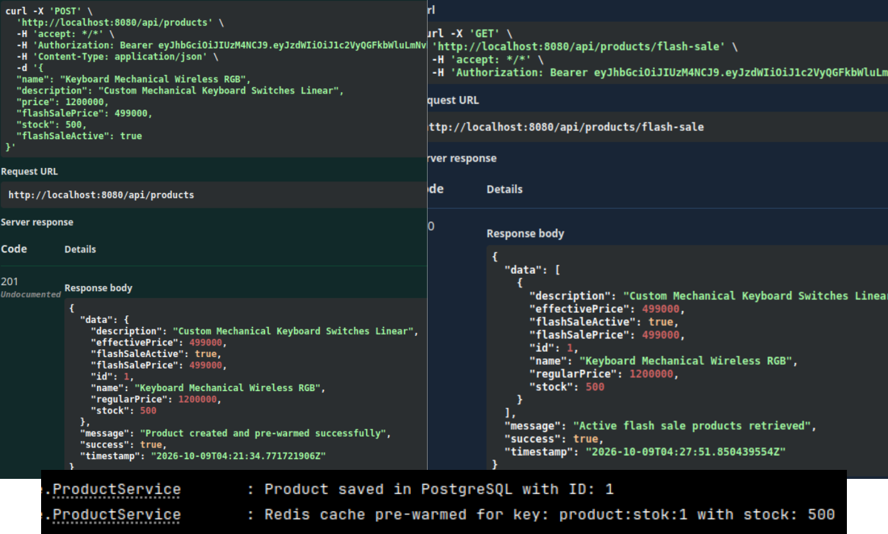
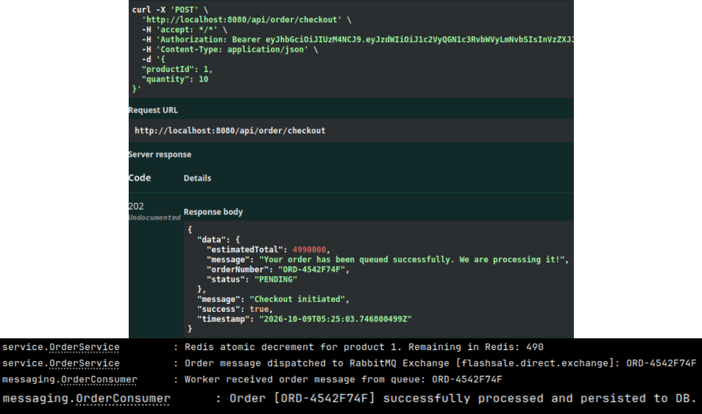
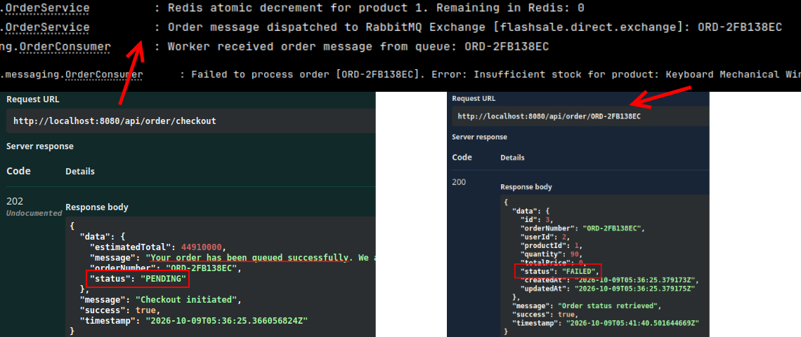
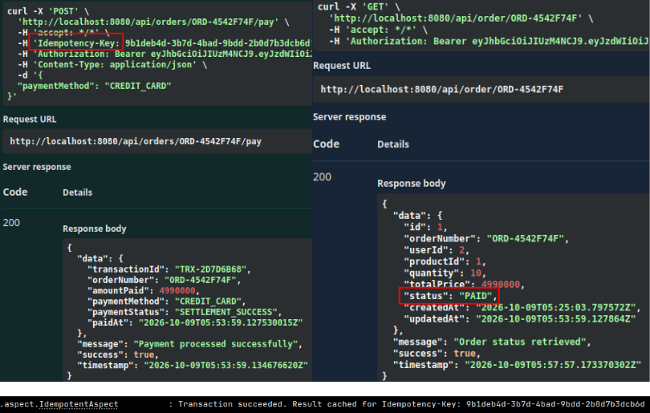
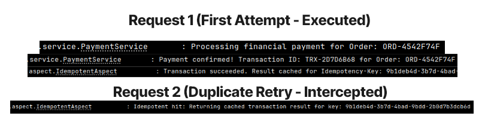

# High-Concurrency Flash Sale Backend API

## 1. Overview

REST API backend untuk **flash sale** dengan lonjakan trafik tinggi dalam waktu singkat. Fokus utama: mencegah **overselling**, menjaga **response time checkout tetap rendah**, dan menjamin **pembayaran tidak terproses ganda**.

| Masalah Bisnis | Solusi | Dampak |
|---|---|---|
| Stok terjual melebihi ketersediaan (overselling) saat checkout bersamaan | Atomic stock decrement di Redis (`DECRBY`) + rollback otomatis | Tidak ada stok negatif, tanpa row-lock di database |
| Checkout lambat karena menunggu penulisan DB | Asynchronous order processing via RabbitMQ (producer–consumer) | Respons checkout instan (`202 Accepted`), beban DB merata |
| Katalog flash sale membebani database | Redis cache pre-warming + database indexing | Pembacaan stok real-time, query lebih cepat |
| Customer klik "Bayar" dua kali / retry jaringan → double charge | Idempotency Key berbasis Redis + Spring AOP | Pembayaran diproses tepat satu kali |
| Endpoint admin diakses user biasa | Stateless JWT + Role-Based Access Control | Pemisahan hak akses Admin & Customer |

---

## 2. Teknologi

| Kategori | Teknologi |
|---|---|
| Language & Framework | Java 17, Spring Boot 4.1 |
| Database | PostgreSQL, Spring Data JPA / Hibernate |
| Cache & Atomic Counter | Redis (Spring Data Redis, Lettuce, Commons Pool2) |
| Message Broker | RabbitMQ (Spring AMQP) |
| Security | Spring Security, JWT (JJWT 0.12), Access & Refresh Token |
| Cross-Cutting Concern | Spring AOP (custom `@Idempotent`) |
| API Documentation | OpenAPI 3 / Swagger UI (springdoc) |
| Validation | Jakarta Bean Validation |
| Build & Infra | Maven, Docker, Docker Compose |
| Utilitas | Lombok |

---

## 3. Fitur Utama

- **Atomic Stock Control** — Pengurangan stok di Redis bersifat atomik; stok tidak cukup → nilai di-rollback.
- **Asynchronous Checkout** — Order dikirim ke RabbitMQ, diproses worker (`OrderConsumer`), lalu disimpan ke PostgreSQL.
- **Cache Pre-Warming** — Stok dimuat ke Redis saat produk dibuat (`product:stok:{id}`).
- **Idempotent Payment** — Header `Idempotency-Key` + Redis `SETNX` + TTL; request duplikat mengembalikan hasil cache.
- **Order State Machine** — `PENDING → PROCESSING → SUCCESS → PAID` (alternatif: `FAILED`, `CANCELLED`).
- **JWT Authentication** — Register, login, dan refresh token (access token 15 menit).
- **Role-Based Access Control** — `ROLE_ADMIN` dan `ROLE_CUSTOMER`; `/admin/**` khusus admin.
- **Shopping Cart** — Keranjang berbasis Redis.
- **Standardized API Response** — Wrapper `success`, `message`, `data`, `timestamp`.
- **Database Indexing** — Index pada kolom `flash_sale_active`.

---

## 4. Cara Instalasi

### Prasyarat

- Java JDK 17
- Maven 3.9+ (atau `./mvnw`)
- Docker & Docker Compose

### 4.1 Clone Repository

```bash
git clone git@github.com:zaidnshr1/flashsale-engine-backend.git
cd flashsale-engine-backend
```

### 4.2 Bangun Container Docker (PostgreSQL, Redis, RabbitMQ)

Jalankan:

```bash
docker compose up -d
docker compose ps
```

### 4.3 Konfigurasi Aplikasi

Edit `src/main/resources/application.properties`:

```properties
server.port=8080
server.servlet.context-path=/api

# PostgreSQL
spring.datasource.url=jdbc:postgresql://localhost:5432/flashsale_db
spring.datasource.username=postgres
spring.datasource.password=postgres
spring.jpa.hibernate.ddl-auto=update

# Redis
spring.data.redis.host=localhost
spring.data.redis.port=6379

# RabbitMQ
spring.rabbitmq.host=localhost
spring.rabbitmq.port=5672
spring.rabbitmq.username=guest
spring.rabbitmq.password=guest
```

> Sesuaikan properti JWT (secret & expiration) dengan konfigurasi pada project Anda.

### 4.4 Jalankan Aplikasi

```bash
./mvnw clean install
./mvnw spring-boot:run
```

### 4.5 Akses

| Layanan | URL |
|---|---|
| Swagger UI | `http://localhost:8080/api/swagger-ui/index.html` |
| RabbitMQ Management | `http://localhost:15672` (guest / guest) |

### 4.6 Alur Pengujian Cepat

1. `POST /auth/register` → buat 1 admin dan 1 customer.
2. `POST /auth/login` → ambil `accessToken`, klik **Authorize** di Swagger.
3. `POST /products` (admin) → buat produk flash sale.
4. `POST /order/checkout` (customer) → dapatkan `orderNumber`.
5. `GET /order/{orderNumber}` → pastikan status `SUCCESS`.
6. `POST /orders/{orderNumber}/pay` + header `Idempotency-Key` (UUID).

---

## 5. Dokumentasi



**Refresh Token — Stateless Session Renewal.** `POST /auth/refresh` menukar refresh token valid dengan access token baru tanpa login ulang. Access token berumur pendek (`expiresIn: 900` detik) untuk meminimalkan risiko penyalahgunaan, sementara server tetap **stateless** (`SessionCreationPolicy.STATELESS`).



**Role-Based Access Control.** `SecurityFilterChain` membatasi `/admin/**` hanya untuk `ROLE_ADMIN`. User Customer yang mengakses `/admin/ping` dan `/admin/orders` ditolak dengan **HTTP 403 Forbidden** melalui `AccessDeniedHandler` dengan format error JSON seragam.



**Cache Pre-Warming & Database Indexing.** Saat produk dibuat, data disimpan ke PostgreSQL (`@Transactional`) lalu stok dimuat ke Redis dengan key `product:stok:{id}`. Index `idx_products_flash_sale` pada `flash_sale_active` mempercepat `GET /products/flash-sale`. Pengecekan stok saat traffic tinggi dilakukan di memori, bukan di database.



**Asynchronous Checkout — Stok Tersedia.** Alur: validasi produk → atomic decrement stok di Redis (sisa 490 setelah beli 10 dari 500) → order dikirim ke exchange RabbitMQ → API langsung merespons `202` status `PENDING` → `OrderConsumer` menyimpan order ke PostgreSQL di background. Pemisahan request handling dan persistence menjaga latency checkout tetap rendah.



**Asynchronous Checkout — Stok Tidak Mencukupi.** Saat permintaan melebihi stok, `OrderConsumer` menolak order dan menandainya `FAILED` (*Insufficient stock*). Client memantau hasil akhir lewat `GET /order/{orderNumber}`. Konsistensi data terjaga tanpa memblokir request lain.



**Pembayaran Berhasil.** `POST /orders/{orderNumber}/pay` mewajibkan header `Idempotency-Key` (UUID dari client). Pembayaran hanya valid jika order berstatus `SUCCESS`; setelah berhasil status menjadi `PAID` dan `transactionId` diterbitkan (`SETTLEMENT_SUCCESS`). Order yang sudah `PAID` atau berstatus lain ditolak.



**Idempotency — Pencegahan Double Payment.** `@Idempotent` diimplementasikan dengan **Spring AOP** (`@Around`) dan Redis `setIfAbsent` ber-TTL 600 detik:

- **Request 1** → dieksekusi, hasil disimpan di Redis.
- **Request 2 (retry, key sama)** → dicegat aspect, mengembalikan hasil cache tanpa memproses ulang.
- Request konkuren saat masih diproses → ditolak (lock `PROCESSING`).
- Eksekusi gagal → key dihapus agar client bisa retry.
